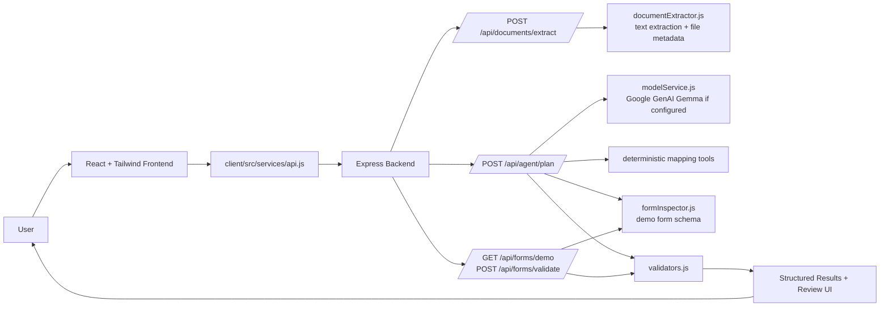

# Form Mitra

Form Mitra is a local prototype for an AI-assisted form-filling workflow. It helps a user paste known information, optionally attach documents, map the available facts to a synthetic form, identify missing or uncertain fields, and review the result before any further action.

The current app is useful for developers, hackathon reviewers, and product reviewers who want to see the shape of a safe form-filling assistant without automating real websites or submitting real applications.

## Project Overview

Many people struggle with long forms because the same information is scattered across messages, IDs, PDFs, or screenshots. Form Mitra explores a safer workflow:

1. The user enters known information in plain language.
2. The app extracts simple facts such as email, phone number, date, and some intent signals.
3. The backend maps those facts to a controlled demo form schema.
4. Missing required fields and low-confidence mappings are surfaced.
5. The user reviews and edits the final values in the browser.

Current status: this is an early working foundation, not a production form automation tool. The React frontend, Express backend, health check, extraction endpoint, planning endpoint, demo form schema, validation, and review UI are implemented. PDF parsing, OCR, real browser form filling, real accessibility scans, persistent storage, and external form submission are not implemented.

## Features

### Working Now

- Responsive React + Tailwind frontend for the Form Mitra workflow.
- Text input for known applicant information.
- File picker for PDFs and images.
- Backend upload handling with file metadata and size limits.
- Simple deterministic extraction for email, phone number, date, raw text, name phrases, program keywords, and notes keywords.
- Optional Gemma analysis through Google GenAI when `GEMINI_API_KEY` is configured.
- Fallback field mapping when the AI provider is not configured or fails.
- Demo form schema for a synthetic "Community Services Request".
- Backend validation for unknown fields, empty values, and low-confidence mappings.
- Missing required field detection.
- Ambiguity handling for low-confidence mappings, such as a single-name input.
- Human review UI where users can edit mapped values before any next step.
- JSON error handling for backend routes.

### Partial or Planned

- PDF and image uploads are accepted, but their contents are not parsed yet. They are reported as queued for a future parser.
- Playwright and `@axe-core/playwright` are installed and scaffolded, but real browser filling and accessibility scanning are not wired into the app.
- A local/open-weight model endpoint branch exists in `modelService.js`, but its HTTP adapter is not implemented.
- There is no database, user account system, authentication, audit log, or persistent document storage.
- The app does not submit real forms.

## Architecture Overview

In plain English: the browser collects the user's draft information, the backend extracts facts and creates a field-mapping plan, validators check the plan against the known demo form schema, and the frontend shows the user what needs review.



Important boundaries:

- The frontend does not call the AI provider directly.
- API keys belong in `server/.env`.
- Validation happens on the backend before mapped values are treated as usable.
- Browser automation is scoped as demo-only and is not active in the current UI.

## How the Application Works

1. The user opens the React frontend and enters text, selects a sample input, or chooses PDF/image files.
2. The frontend calls `POST /api/documents/extract` through `client/src/services/api.js`.
3. The backend receives multipart form data with `multer`, trims the text, extracts simple facts, and returns file metadata. File contents are not OCR'd or parsed yet.
4. The frontend sends the extraction result to `POST /api/agent/plan`.
5. The backend builds a planning prompt and calls `modelService.js`.
6. If `MODEL_PROVIDER` is Google/Gemini/Gemma and `GEMINI_API_KEY` is set, the backend calls Google GenAI with `MODEL_NAME`.
7. If the AI provider is missing, unavailable, or returns unusable mapping JSON, the backend falls back to deterministic mapping logic in `server/agent/tools.js`.
8. The backend validates proposed mappings against the demo form schema from `server/services/formInspector.js`.
9. Required fields that were not mapped become `missingFields`. Low-confidence mappings become `ambiguities`.
10. The frontend displays the summary, extracted facts, missing questions, confidence tags, and editable review form.

## Technology Stack

| Area | Technology | What it does |
| --- | --- | --- |
| Language | JavaScript ES modules | Shared language for client and server code |
| Frontend | React 19 | Builds the browser UI |
| Frontend tooling | Vite 7 | Dev server and production build |
| Styling | Tailwind CSS 4 with `@tailwindcss/vite` | Responsive utility-first styling |
| Backend | Node.js 20+ and Express 5 | HTTP API and route handling |
| Uploads | `multer` | Accepts multipart file uploads for the extraction endpoint |
| AI integration | `@google/genai` | Calls Gemma/Gemini-compatible Google GenAI models when configured |
| Environment loading | `dotenv` | Loads `server/.env` into the backend process |
| Browser automation scaffold | Playwright | Installed for future demo-form automation |
| Accessibility scaffold | `@axe-core/playwright` | Installed for future accessibility scans |
| Storage | Local files only | No database is implemented |

## Prerequisites

- Node.js 20 or newer. The project was inspected with Node `v24.11.1`.
- npm. On Windows PowerShell, use `npm.cmd` if `npm` is blocked by script execution policy.
- Optional: a Google GenAI API key if you want the Gemma-backed model call to run.

No database or external storage service is required for the current prototype.

## Installation and Local Setup

Clone the repository:

```bash
git clone https://github.com/furqhan24/FormMitra.git
cd FormMitra
```

Install dependencies:

```bash
npm install --prefix client
npm install --prefix server
```

Or use the root helper:

```bash
npm run install:all
```

Create the backend environment file:

```bash
copy server\.env.example server\.env
```

On macOS or Linux:

```bash
cp server/.env.example server/.env
```

Edit `server/.env` and replace the placeholder key only if you want AI-provider calls:

```env
GEMINI_API_KEY=your_real_api_key_here
```

Start the backend:

```bash
npm run dev --prefix server
```

Start the frontend in a second terminal:

```bash
npm run dev --prefix client
```

You can also start both processes from the root:

```bash
npm run dev:all
```

Open the URL printed by Vite, usually:

```text
http://localhost:5173
```

If port `5173` is already in use, Vite may print another port such as `5174`. Use the printed URL.

## Environment Variables

Backend variables are loaded from `server/.env`.

| Variable | Purpose | Used in | Required? | Safe example |
| --- | --- | --- | --- | --- |
| `PORT` | Backend port | `server/server.js` | No | `4000` |
| `CLIENT_ORIGIN` | CORS origin allowed by Express | `server/server.js` | No | `http://localhost:5173` |
| `MODEL_PROVIDER` | Selects AI provider branch | `server/services/modelService.js` | No | `google-gemma` |
| `MODEL_NAME` | Model name passed to the provider | `server/services/modelService.js` | No | `gemma-4-26b-a4b-it` |
| `GEMINI_API_KEY` | Google GenAI API key | `server/services/modelService.js` | Required only for AI calls | `your_gemini_api_key_here` |
| `MODEL_ENDPOINT` | Future local/open-weight endpoint URL | `server/services/modelService.js` | No, adapter not implemented | `http://localhost:11434` |
| `ENABLE_DEMO_BROWSER_AUTOMATION` | Future flag for demo-only browser automation | `server/browser/browserAgent.js` | No | `false` |

Frontend API configuration:

| Variable | Purpose | Used in | Required? | Safe example |
| --- | --- | --- | --- | --- |
| `VITE_API_BASE_URL` | Overrides the backend API base URL | `client/src/services/api.js` | No | `http://localhost:4000/api` |

Never commit real secrets. `server/.env` is intended to remain local and private.

## API Documentation

All backend routes are mounted under `/api`.

| Method | Path | Purpose | Inputs | Response behavior |
| --- | --- | --- | --- | --- |
| `GET` | `/api/health` | Confirms the backend is running | None | Returns service name, model provider label, and automation scope |
| `POST` | `/api/documents/extract` | Extracts text facts and records upload metadata | Multipart form data: `text`, optional `documents` files | Returns `extractedText`, `facts`, `files`, and `limitations` |
| `POST` | `/api/agent/plan` | Creates a field-mapping plan | JSON body with an `extracted` object | Returns form schema, summary, mappings, missing fields, ambiguities, validation, and model status |
| `GET` | `/api/forms/demo` | Returns the synthetic demo form schema | None | Returns field names, labels, types, required flags, and fixture metadata |
| `POST` | `/api/forms/validate` | Validates proposed mappings | JSON body: `{ "mappings": [...] }` | Returns `valid`, `issues`, and sanitized mappings |

Example health check:

```bash
curl http://localhost:4000/api/health
```

Example response:

```json
{
  "ok": true,
  "service": "form-mitra-server",
  "modelProvider": "google-gemma",
  "automationScope": "demo-form-only"
}
```

Example validation request:

```bash
curl -X POST http://localhost:4000/api/forms/validate \
  -H "Content-Type: application/json" \
  -d "{\"mappings\":[{\"field\":\"email\",\"value\":\"pavan@example.com\",\"confidence\":0.95,\"source\":\"manual-test\"}]}"
```

Example validation response:

```json
{
  "valid": true,
  "issues": [],
  "mappings": [
    {
      "field": "email",
      "value": "pavan@example.com",
      "confidence": 0.95,
      "source": "manual-test"
    }
  ]
}
```

## Project Structure

```text
FormMitra/
  client/
    public/
      demo-form-pattern.svg
      favicon.svg
    src/
      components/
        ChatPanel.jsx
        FileUpload.jsx
        FormPreview.jsx
        IssueCard.jsx
      pages/
        Home.jsx
      services/
        api.js
      App.jsx
      index.css
      main.jsx
    index.html
    package.json
    vite.config.js
  server/
    accessibility/
      scanner.js
    agent/
      agent.js
      prompts.js
      tools.js
    browser/
      browserAgent.js
      formFiller.js
    routes/
      agentRoutes.js
      documentRoutes.js
      formRoutes.js
    services/
      documentExtractor.js
      formInspector.js
      modelService.js
    utils/
      validators.js
    .env.example
    package.json
    server.js
  data/
    demo-form/
      index.html
  docs/
    architecture.md
  scripts/
    dev.mjs
  LICENSE
  README.md
  package.json
```

Key responsibilities:

- `client/src/pages/Home.jsx`: main user workflow.
- `client/src/services/api.js`: frontend API wrapper and error handling.
- `server/server.js`: Express app setup, health route, route mounting, and JSON error handling.
- `server/services/documentExtractor.js`: text extraction and file metadata.
- `server/services/modelService.js`: AI provider integration.
- `server/agent/agent.js`: planning orchestration and fallback behavior.
- `server/agent/tools.js`: deterministic field-mapping heuristics.
- `server/services/formInspector.js`: demo form schema.
- `server/utils/validators.js`: backend mapping validation.
- `data/demo-form/index.html`: synthetic local demo form fixture.

## Testing and Troubleshooting

There is no automated unit test suite yet. The available checks are build and syntax checks.

Run the frontend production build:

```bash
npm run build --prefix client
```

Run the backend syntax check:

```bash
npm run check --prefix server
```

Check backend health after starting the server:

```bash
curl http://localhost:4000/api/health
```

Common issues:

| Problem | Likely cause | Fix |
| --- | --- | --- |
| Frontend says backend is unavailable | Backend is not running or CORS origin does not match | Start `npm run dev --prefix server`; confirm `CLIENT_ORIGIN` matches the frontend URL |
| AI status says key is not set | `GEMINI_API_KEY` is missing or still a placeholder | Put the real key in `server/.env` and restart the backend |
| PowerShell blocks `npm` or `npx` | Script execution policy blocks `.ps1` shims | Use `npm.cmd` or `npx.cmd` |
| Uploaded PDFs/images do not produce extracted text | OCR/PDF parsing is not implemented | Use the text box for now |
| Low-confidence or missing fields appear | The backend could not confidently map required fields | Fill or correct values in the review form |
| AI call fails | Invalid key, provider outage, unsupported model name, or network issue | Check `GEMINI_API_KEY`, `MODEL_NAME`, and backend console output |

## Security, Privacy, and Limitations

- API keys must stay in `server/.env`, not in frontend code or committed files.
- The frontend never sends provider credentials.
- Uploaded files are accepted by the backend route, but content extraction for PDFs/images is not implemented.
- The repository ignores local uploads and environment files.
- The app uses synthetic demo data and a local demo form fixture.
- The app does not bypass login, OTP, CAPTCHA, authentication controls, or website restrictions.
- The app does not submit real applications.
- The user review step is part of the current UI, but there is no production-grade audit log or permission system.
- No database or long-term storage policy is implemented.

## Roadmap and Contributions

Current functionality is focused on a safe demo workflow. Useful next steps:

- Add real PDF text extraction.
- Add image OCR.
- Add a local/open-weight model HTTP adapter for `MODEL_ENDPOINT`.
- Add Playwright filling for only `data/demo-form/index.html`.
- Run `@axe-core/playwright` against the demo form and review UI.
- Add unit tests for extraction, mapping, validation, and route behavior.
- Add end-to-end tests for the sample user flows.
- Add a clearer correction flow for missing fields.

Contribution guidance:

1. Open an issue describing the bug, limitation, or feature.
2. Keep changes scoped and avoid committing secrets, real documents, or generated uploads.
3. Run the frontend build and backend check before opening a pull request.
4. Document any new environment variables, routes, or setup steps in this README.

## License and Credits

This repository includes an MIT License in [LICENSE](LICENSE).

Form Mitra currently uses React, Vite, Tailwind CSS, Express, Google GenAI, Multer, Playwright, and axe-core's Playwright integration.
